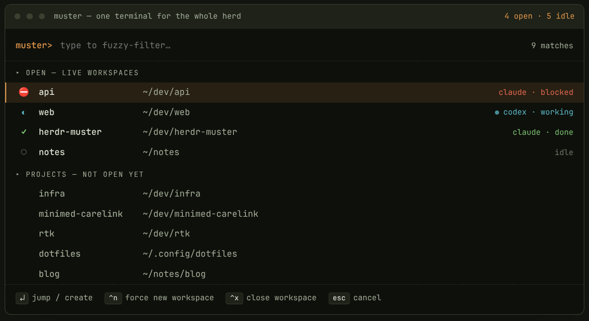

# muster

An agent-aware project switcher for [herdr](https://herdr.dev/) inspired by [Tmux Sesh](https://github.com/joshmedeski/sesh)

Hit one key and you get a fuzzy list of your projects. The ones already running
show up first, tagged with what their agent is doing (blocked, working, done, or
idle), and anything blocked floats to the top so you know where you're needed.
Everything else sits below, one keypress away from a fresh workspace.

Each project maps to exactly one workspace. muster remembers that pairing from
the moment it creates the workspace, so it never guesses the project from
whatever directory a pane happens to be sitting in, and you never end up with
two workspaces for the same repo.

## Install

You'll need a Rust toolchain, since `herdr plugin install` compiles the binary
from source when it sets the plugin up.

    herdr plugin install marcoskichel/herdr-muster

### Working on it locally

    cargo build --release
    herdr plugin link /path/to/herdr-muster   # e.g. ~/dev/herdr-muster

## Configure

    herdr plugin config-dir kichel.muster   # prints the config dir

Copy `config.toml.example` into that directory as `config.toml` and edit it:

- `paths` lists directories you always want to see.
- `roots` gets scanned one level deep for git repos.
- `use_zoxide` folds in your `zoxide query -l` results when zoxide is installed.

## Bind it to a key

Add this to your herdr `config.toml`, then run `herdr server reload-config`:

    [[keys.command]]
    key = "prefix+space"
    type = "shell"
    command = "herdr plugin pane open --plugin kichel.muster --entrypoint picker"

## Keys inside the switcher

- Type to fuzzy filter, arrow keys to move.
- Enter jumps to the project. If it's open it focuses that workspace, otherwise
  it musters a new one.
- Ctrl-N forces a brand new workspace for the selected directory.
- Ctrl-X closes the selected open workspace.
- Esc or Ctrl-C backs out.
